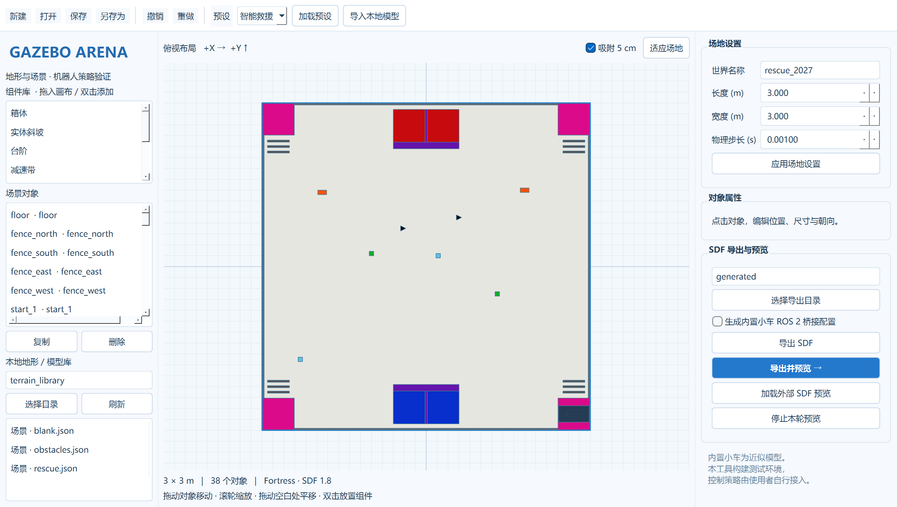
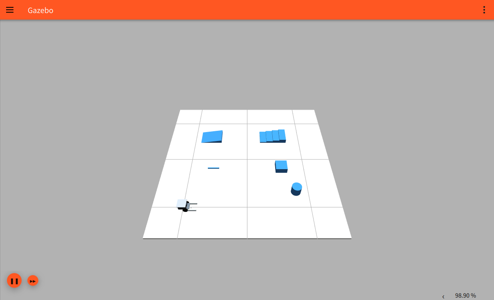

# GazeboArena

[English](README_en.md) · [安装](docs/installation.md) · [资源导入](docs/resources.md) · [策略接入](docs/policy-integration.md)

**面向机器人策略验证的 Gazebo 地形与场景工具。** 在桌面编辑场地、组织地形和模型，导出可迁移的 SDF 场景，然后在 Gazebo Fortress 中运行你自己的控制策略。



## 功能

- 蓝白色桌面编辑器：俯视布局、组件拖放、位置/尺寸/朝向编辑、复制、删除、缩放、5 cm 网格吸附、撤销/重做。
- 三个可编辑预设：智能救援、空白场地、基础越障。
- 地形组件：平地、实体斜坡、台阶、减速带、箱体、圆柱；救援物资与双相机小车。
- 本地模型目录导入、地形库浏览、外部完整 SDF 场景预览。
- 带版本的 `scene.json` 项目文件；SDF 和模型资源一起导出，复制目录即可迁移。
- Ubuntu 上独立 Gazebo 预览、隔离的 Transport 分区、每轮日志和进程清理。
- 可选内置小车 ROS 2 Humble 桥接配置。编辑和导出无需 ROS。



## 快速开始

核心命令需要 Python 3.10+；本版 PySide6 图形界面使用 Python 3.10–3.13，推荐 3.10。Ubuntu 22.04 + Gazebo Fortress 是仿真验收环境；Windows 支持编辑与导出。

```bash
git clone https://github.com/avo940745-sys/GazeboArena.git
cd GazeboArena
python -m venv .venv
# Ubuntu
source .venv/bin/activate
# Windows PowerShell: .\.venv\Scripts\Activate.ps1
python -m pip install -e '.[gui]'
gazeboarena edit
```

或使用 `bash install.sh` / PowerShell `./install.ps1` 安装后启动。有 `uv` 时，脚本自动选择 Python 3.10。

```bash
# 导出完整救援场景和可选桥接配置
gazeboarena export --preset rescue --bridge --output generated
# 基础地形场景
gazeboarena edit --preset obstacles --output generated
# 继续编辑自己的工程
gazeboarena edit --scene /path/to/scene.json --library /path/to/library
# 基础结构和资源检查（Windows / Ubuntu）
gazeboarena validate /path/to/world.sdf
# Fortress 原生检查和预览（Ubuntu）
gazeboarena validate /path/to/world.sdf --native
gazeboarena view /path/to/world.sdf
```

每次导出得到独立目录，不覆盖已有成果：

```text
output_YYYYMMDD_HHMMSS/
  world.sdf
  scene.json
  models/       # 有网格或导入模型时生成
  bridge.yaml   # --bridge / 勾选桥接时生成
  arena_gui.config
  view.sh
```

将**整个目录**复制到 Ubuntu 后，在目录中运行 `bash view.sh`；也可以安装本工具后执行 `gazeboarena view world.sdf`，获得启动管理与每轮日志。Windows 首版不提供远程一键启动。

## 使用边界

本工具提供验证环境，不包含策略训练、救援任务控制器、YOLO 权重或自动评分。外部策略通过 Gazebo Transport 或 ROS 2 接入。

内置机器人是原智能救援仿真中的**近似模型**，不是 SolidWorks 原装配导出。原救援预设保留其默认布局、碰撞与物理参数；安全区入口的薄坡面仍仅有视觉，不作为实体越障组件。新“实体斜坡”使用闭合三棱柱网格，同时具有视觉和碰撞。地形可加载不等于任意策略能通过。

自有工程可以完整编辑；导入模型仅调整整体位姿；外部完整 SDF 按原文件预览，不反向转换为可编辑工程。首版每个场景最多包含一台内置小车。内置小车和目标的惯量、质量及摩擦为仿真参数，不代表官方实物。[素材来源与近似说明](docs/provenance.md)

## 开发

```bash
python -m pip install -e '.[gui,dev]'
python -m pytest -q
python -m build
```

首版验证结果见 [验收记录](docs/validation.md)，包含真实 Ubuntu 桌面截图和物理接触检查。

数据/预设、资源检查、导出器、Qt 编辑器与启动管理分别位于 `src/gazeboarena/`。核心模块不依赖 Qt、ROS、YOLO。运行记录默认写入场景目录的 `runs/`，不包含继承环境或凭据。

## 许可与致谢

代码和获授权的自有程序化模型采用 [Apache-2.0](LICENSE)。功能和编辑流程参考 [ArenaX](https://github.com/Lain-Ego0/ArenaX)，未复制其代码、机器人资产或策略。第三方依赖保留各自许可，详见 [第三方说明](THIRD_PARTY_NOTICES.md)。
