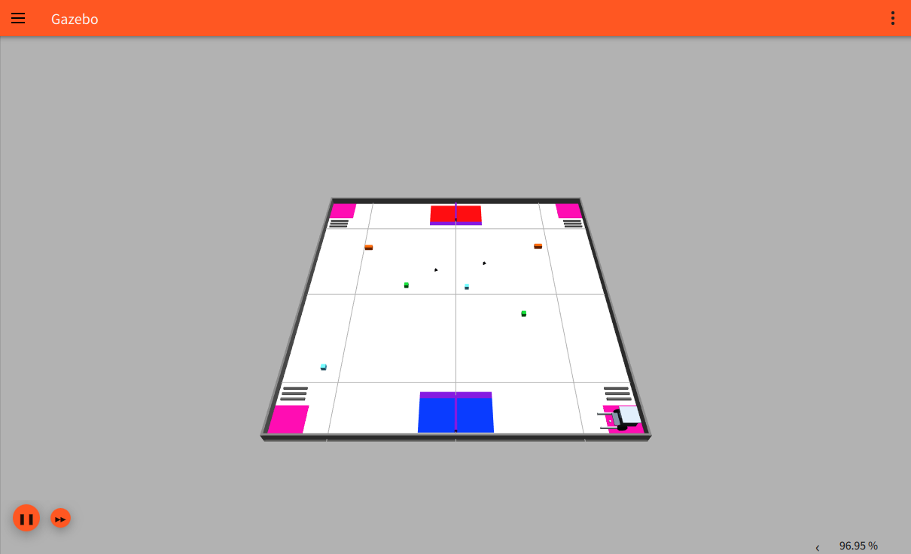

# GazeboArena

**A Gazebo terrain and scene builder for robot policy validation.**

[简体中文](README.md) · [Installation](docs/installation.md) · [Models and terrain library](docs/resources.md) · [Policy integration](docs/policy-integration.md) · [v0.1.0](https://github.com/avo940745-sys/GazeboArena/releases/tag/v0.1.0)

Build an arena, edit terrain parameters, organize local models, and export a portable SDF world from one desktop tool. Start with a rescue or blank preset, place obstacles and a robot, then connect your own controller in Gazebo Fortress.

[ArenaX](https://github.com/Lain-Ego0/ArenaX) inspired the editing workflow. GazeboArena implements its own Gazebo toolchain, with authorized procedural models and a rescue preset extracted from the original intelligent rescue simulator.

## Editor and simulation examples

### Desktop scene editor

Components and local resources on the left, a top-down canvas in the center, and editable properties and export controls on the right. The initial PySide6 Widgets UI is Simplified Chinese.


### Rescue arena

A 3 m arena with fences, a start area, safe zones, bumps, eight targets and the rescue robot, running in a separate native Gazebo window.



### Basic obstacle arena

Solid ramps, stairs, bumps, boxes and cylinders include visual and collision geometry for contact and traversal experiments.


## Features and platforms

| Feature | Supported behavior |
| --- | --- |
| Scene editing | Drag-and-drop, move, rotate, duplicate, delete, zoom, 5 cm snapping, undo/redo |
| Terrain | Flat surfaces, solid ramps, stairs, bumps, boxes, cylinders and rescue assets |
| Properties | Arena size, dimensions and six-component poses; applicable color, collision, mass, friction and static settings |
| Projects | Versioned `scene.json` files that can be reopened and edited |
| Resources | Whole-model folder import, local library browsing, complete external SDF/world preview |
| Export | Portable SDF 1.8 worlds, editable projects and required local resources |
| Preview | Separate Fortress window, isolated Transport partitions, session logs and owned-process cleanup |
| Controllers | Gazebo Transport or optional ROS 2 Humble bridge configuration for the built-in robot |

Windows supports editing, saving, importing, exporting and basic checks. Full preview targets **Ubuntu 22.04 + Gazebo Fortress 6.x**. ROS 2 Humble is optional; editing and exporting do not require ROS.

The core requires Python 3.10+. The pinned PySide6 editor supports Python 3.10–3.13; Python 3.10 is recommended.

## Quick start

### Windows PowerShell

Install Git and either a supported Python or `uv`:

```powershell
git clone https://github.com/avo940745-sys/GazeboArena.git
cd GazeboArena
.\install.ps1
```

Use `.\install.ps1 -NoRun` to install without opening the editor. When `uv` is available, the installer selects Python 3.10; otherwise it uses your supported Python. Existing `.venv` environments are preserved.

```powershell
.\.venv\Scripts\gazeboarena.exe edit --preset obstacles
.\.venv\Scripts\gazeboarena.exe export --preset rescue --bridge --output generated
```

### Ubuntu 22.04

Install Gazebo using the [official Fortress instructions](https://gazebosim.org/docs/fortress/install_ubuntu/). The project installer only installs Python dependencies.

```bash
sudo apt-get install git python3-venv libxcb-cursor0 libxkbcommon-x11-0 libxcb-xinerama0
git clone https://github.com/avo940745-sys/GazeboArena.git
cd GazeboArena
bash install.sh
```

Use `bash install.sh --no-run` for installation only. For subsequent terminal commands:

```bash
source .venv/bin/activate
gazeboarena edit --preset rescue
```

GUI preview requires a desktop and working OpenGL. See the [installation guide](docs/installation.md) for manual installation and rendering diagnostics. Detailed guides currently use Chinese.

## Presets and components

| Preset | Contents |
| --- | --- |
| `rescue` | Original 3 × 3 m layout, 38 models, eight targets and one rescue robot |
| `blank` | A 3 × 3 m base floor |
| `obstacles` | Floor, solid ramp, stairs, bump, box, cylinder and rescue robot |

```bash
gazeboarena edit --preset blank
gazeboarena edit --preset obstacles
gazeboarena export --preset rescue --bridge --output generated
```

| Component | Default dimensions in meters |
| --- | --- |
| `flat` | Length 1.00, width 1.00, thickness 0.03 |
| `ramp` | Length 0.40, width 0.30, height 0.06 |
| `stairs` | Total length 0.50, width 0.30, step height 0.02, 4 steps |
| `bump` | Length 0.20, width 0.018, height 0.016 |
| `box` | Length 0.20, width 0.20, height 0.10 |
| `cylinder` | Radius 0.08, height 0.15 |

Ramps rise along local **+X** and use closed triangular-prism meshes. Stairs use solid boxes. Terrain components remain static; boxes and cylinders can be dynamic.

## Editing and export workflow

1. Open a preset or `scene.json`, then drag components into the canvas.
2. Move objects and edit dimensions, position and orientation; apply the property changes.
3. Save your project and choose export and preview.
4. Ubuntu opens Gazebo in a separate window. Windows shows the export location and Ubuntu launch command.

Drag empty canvas space to pan and use the mouse wheel to zoom. Rotate with the ±15° buttons or edit `yaw` in radians. Shortcuts: `Ctrl+D` duplicate, `Delete` remove, `Ctrl+Z` undo, `Ctrl+Shift+Z` redo, `Ctrl+S` save, `Ctrl+Shift+S` save as, `Ctrl+N` new and `Ctrl+O` open.

Units are **meters and radians**. The top-down canvas maps +X right and +Y up; world +Z is up. Box, cylinder and bump poses refer to their geometric centers; ramp and stair poses refer to their bases. Check Z after changing height. Changing arena size resizes the floor without scaling fences or other objects.

Each export creates a new directory without overwriting previous exports:

```text
generated/output_YYYYMMDD_HHMMSS/
├── world.sdf
├── scene.json
├── models/            # Created when resources are needed
├── bridge.yaml        # Optional; requires the built-in robot
├── arena_gui.config
└── view.sh
```

Copy the **whole directory** to Ubuntu and run `bash view.sh` inside it. GazeboArena does not need the original rescue workspace. With GazeboArena installed, use managed preview for session logs and process cleanup:

```bash
# Replace these paths with your actual export directory
gazeboarena validate "/path/to/output_directory/world.sdf"
gazeboarena validate "/path/to/output_directory/world.sdf" --native
gazeboarena view "/path/to/output_directory/world.sdf"
gazeboarena edit --scene "/path/to/output_directory/scene.json"
```

Basic validation checks structure and local resources. `--native` additionally runs Fortress `ign sdf -k`. For a bounded server run, use `gazeboarena view world.sdf --headless --iterations 100`; worlds with cameras still need a rendering environment.

## Terrain library and local models

The repository's `terrain_library/` contains editable presets. Select another directory in the editor or run:

```bash
gazeboarena edit --library "/path/to/my library"
```

The library discovers direct children:

| Resource | Double-click action |
| --- | --- |
| GazeboArena `.json` project | Open as an editable scene |
| Folder with `model.sdf` or `model.config` | Import a whole model and edit its pose |
| Complete `.sdf` / `.world` | Preview the original file while retaining the editor scene |

Imported models must be self-contained, using relative paths or `model://` references to their own directory. Missing resources and unpackable dependencies produce errors; external models are not downloaded automatically. System plugins must be installed on the simulation host.

Saving a project with imported models creates a neighboring `<filename>_assets/` directory; move both together. An exported `scene.json` references bundled resources and can be reopened elsewhere. See the [resource guide](docs/resources.md) for import requirements and limits.

## Robot and external controllers

The built-in `rescue_bot` retains two 640 × 480 cameras, IMU, odometry, fork joints and three contact sensors. Each editable scene permits one built-in robot with an editable spawn pose.

This is an **approximate rescue model**, using differential drive, a 0.13 m wheel track and 0.038 m wheel radius. Some dimensions, masses and friction values are simulation assumptions rather than measurements.

| Common topics | Purpose |
| --- | --- |
| `/cmd_vel` | Motion commands through `linear.x` and `angular.z` |
| `/fork/left/cmd`, `/fork/right/cmd` | Fork joint commands |
| `/camera/image`, `/camera/gripper/image` | Camera images |
| `/imu`, `/odom` | Inertial and odometry data |
| `/fork/contact_left`, `/fork/contact_right`, `/fork/contact_front` | Contact feedback |
| `/clock` | Simulation clock |

Export with `--bridge` or enable the bridge option in the editor. Start preview, then use its **same `IGN_PARTITION`** in the bridge terminal:

```bash
export IGN_PARTITION=gazeboarena-REPLACE_WITH_SESSION_PARTITION
source /opt/ros/humble/setup.bash
ros2 run ros_gz_bridge parameter_bridge --ros-args -p config_file:=/absolute/path/bridge.yaml
```

Native Gazebo Transport is also supported. See [policy integration](docs/policy-integration.md) for message types, fork limits and control examples.

## Python API

The CLI and editor share scene and export logic:

```python
from gazeboarena import export_scene, make_preset, save_scene

scene = make_preset("blank")
ramp = scene.add("ramp", x=0.4, y=0.0)
ramp.params.update(length=0.6, width=0.4, height=0.1)
ramp.pose[5] = 0.5  # yaw in radians
scene.add("robot", x=-0.8, y=0.0)

save_scene(scene, "generated/my_scene.json")
directory = export_scene(scene, "generated", bridge=True)
print(directory / "world.sdf")
```

## Development and verification

```bash
python -m pip install -e '.[gui,dev]'
python -m pytest -q
python -m build
```

`scene.py` and `presets.py` handle data and presets; `resources.py` checks and bundles models; `exporter.py` generates worlds and bridge configurations; `editor.py` implements the UI; `runtime.py` and `validation.py` manage preview and checks; `cli.py` exposes the public commands. All are under `src/gazeboarena/`.

GitHub Actions covers Windows/Ubuntu core and offscreen editor tests plus Fortress scene loading. v0.1.0 was also checked on a real Ubuntu desktop, including relocation, sensor output and physical terrain contacts. See the [validation record](docs/validation.md) and [contribution guide](CONTRIBUTING.md).

## Scope and model notes

- The initial release does not include policy training, an ONNX policy runner, the original rescue controller or automatic evaluation. Valid loading and contact behavior do not prove policy success.
- Preview uses a separate Gazebo window. Remote one-click Windows-to-Ubuntu launch is not implemented.
- Imported models expose whole-model poses only. Complete external SDF worlds are not reverse-converted into editable projects.
- The original rescue preset preserves its geometry and default physics, including visual-only thin entrance slopes. Use the new solid ramp component for traversal experiments.

Managed preview uses an isolated `IGN_PARTITION`, sanitizes Qt plugin paths, records sessions under the world's `runs/` directory, and cleans up only its own preview processes.

## License and acknowledgments

Project code and authorized procedural assets use [Apache-2.0](LICENSE). See [provenance](docs/provenance.md) for sources and approximations, and [third-party notices](THIRD_PARTY_NOTICES.md) for dependency licenses.

Thanks to [ArenaX](https://github.com/Lain-Ego0/ArenaX) for the scene-editing inspiration. Its code, robot assets and policies are not included. The original platform's official documents, firmware, YOLO weights, credentials, historical logs and large recordings are excluded from this repository.
