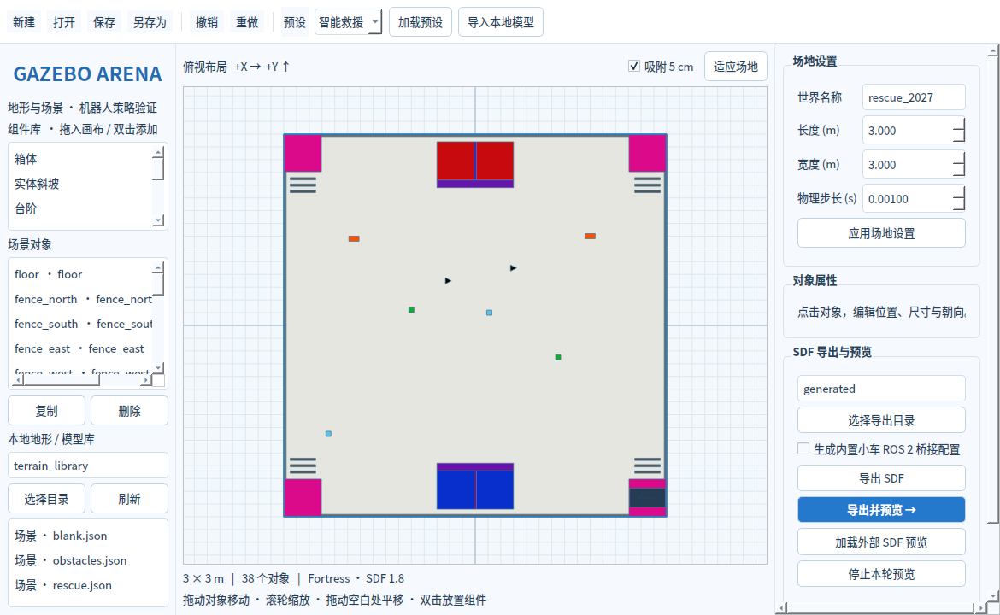

# v0.1.0 验证记录

验证日期：2026-10-09。验证环境为 Windows / Python 3.10.21，以及现有 Ubuntu 22.04 / Python 3.10.12 / Gazebo Fortress 6.18.0；图形界面使用 PySide6 6.8.3。

| 检查 | 结果 |
| --- | --- |
| Windows 核心与界面测试 | 43 项通过，1 项 POSIX 进程测试按平台跳过 |
| Ubuntu 同一测试集 | 44 项全部通过 |
| 原救援预设 | 保留 38 个模型、8 个目标、6 个传感器和 4 个小车插件；原生成脚本哈希未变化 |
| 三个预设 | Fortress 原生 SDF 检查、服务器实际加载与目录迁移全部通过 |
| 双相机与 IMU | 两路相机均收到 640×480 图像数据，IMU 收到实际消息 |
| 实体碰撞 | 自由落下的物块分别由平地、实体斜坡和台阶支撑，测量高度符合对应表面 |
| 本地模型导入 | 自包含模型打包、原生解析及实际加载通过 |
| Ubuntu 真实桌面 | 编辑器、救援与越障 Gazebo 窗口启动、渲染、截图与停止通过；使用实际桌面 :0 |
| ROS 2 Humble 桥接 | IMU、里程计和仿真时钟收到实际 ROS 消息 |
| 进程隔离 | 独立分区，包含独立进程组的子进程可清理；同分区外部桥接器不会被预览停止操作结束 |
| 安装包 | wheel 在新的 Python 环境中安装后可独立导出、验证场景 |

原生与桌面验证脚本位于 `scripts/verify_fortress.py`、`scripts/verify_desktop.py`，可选桥接检查为 `scripts/verify_bridge.py`。这些脚本不运行原救援任务控制器，也不把测试场景加载成功视为策略通过率。

修复并回归的问题包括：斜坡三角面朝向与显式法线、原生 SDF 检查的工作目录，以及 Fortress 为服务器/GUI 创建独立进程组后的退出清理。碰撞网格和相对路径另有自动化回归测试。

GitHub Actions 为后续每次提交执行 Windows/Ubuntu 测试、包构建及 Fortress 原生加载/接触验证。工作流服务器使用 Xvfb；真实桌面截图与验收来自本次 Ubuntu 桌面环境，二者不混算。
